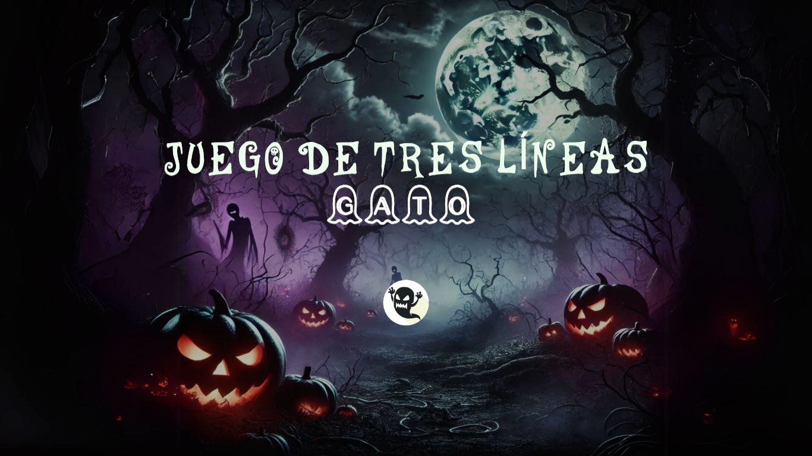
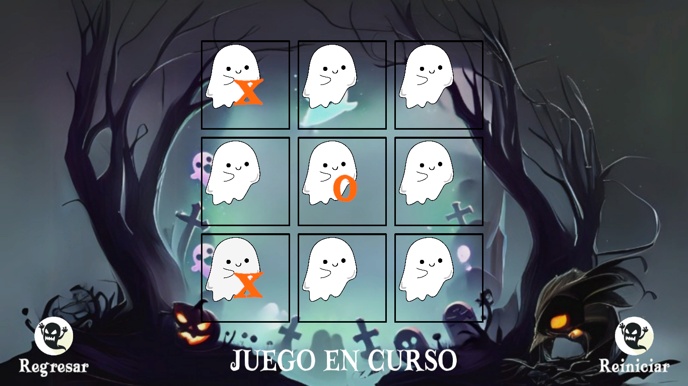
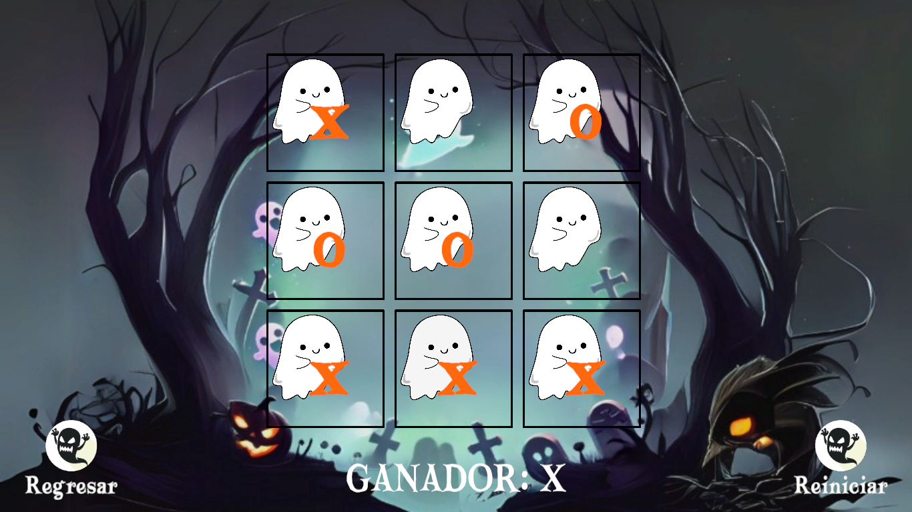
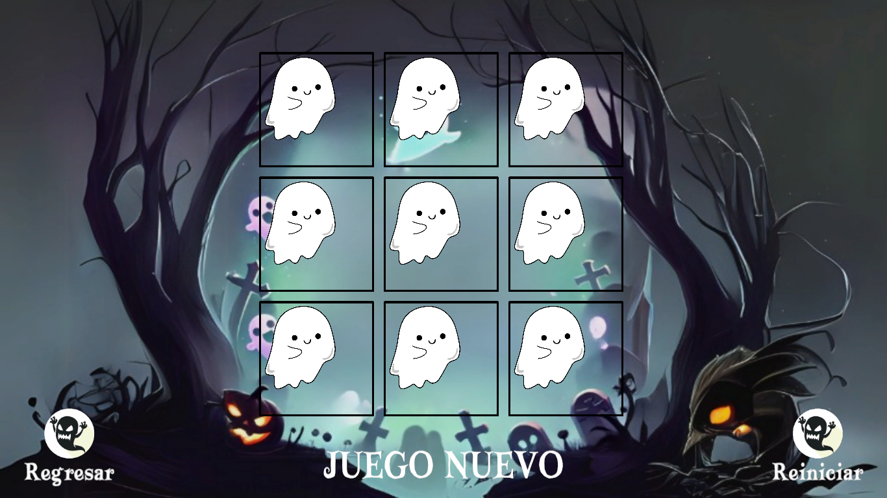

# Juego Tic-Tac-Toe 🎮🐾

## Propósito general

El propósito de este proyecto es desarrollar un videojuego sencillo utilizando Unity, que permita comprender los conceptos básicos del desarrollo de juegos, como:

- Diseño de interfaz y escenas.
- Lógica de turnos entre dos jugadores.
- Detección de condiciones de victoria o empate.
- Interacción mediante clicks y reinicio del juego.

## Resultado

El resultado final es un juego funcional de Gato para dos jugadores locales, con las siguientes características:

- Tablero
- Alternancia automática entre el jugador X y el jugador O.
- Detección del ganador o del empate.
- Botón para reiniciar el tablero y comenzar una nueva partida.

A continuación se muestran imagénes del ejecutable.

#### Inicio

#### Juego en curso

#### Mostrar ganador

#### Partida nueva

## Colaboradores ✍🏼
El proyecto fue realizado para la materia de *Graficación por Computadora* en la Facultad de Estudios Superiores Aragón durante el semestre **2025-II**.

💻 Cuevas Tello Eduardo **([cuevasedu04](https://github.com/cuevasedu04))**  
💻 García Estrada Ariadna Denisse **([ariadna-ge](https://github.com/ariadna-ge))**  
